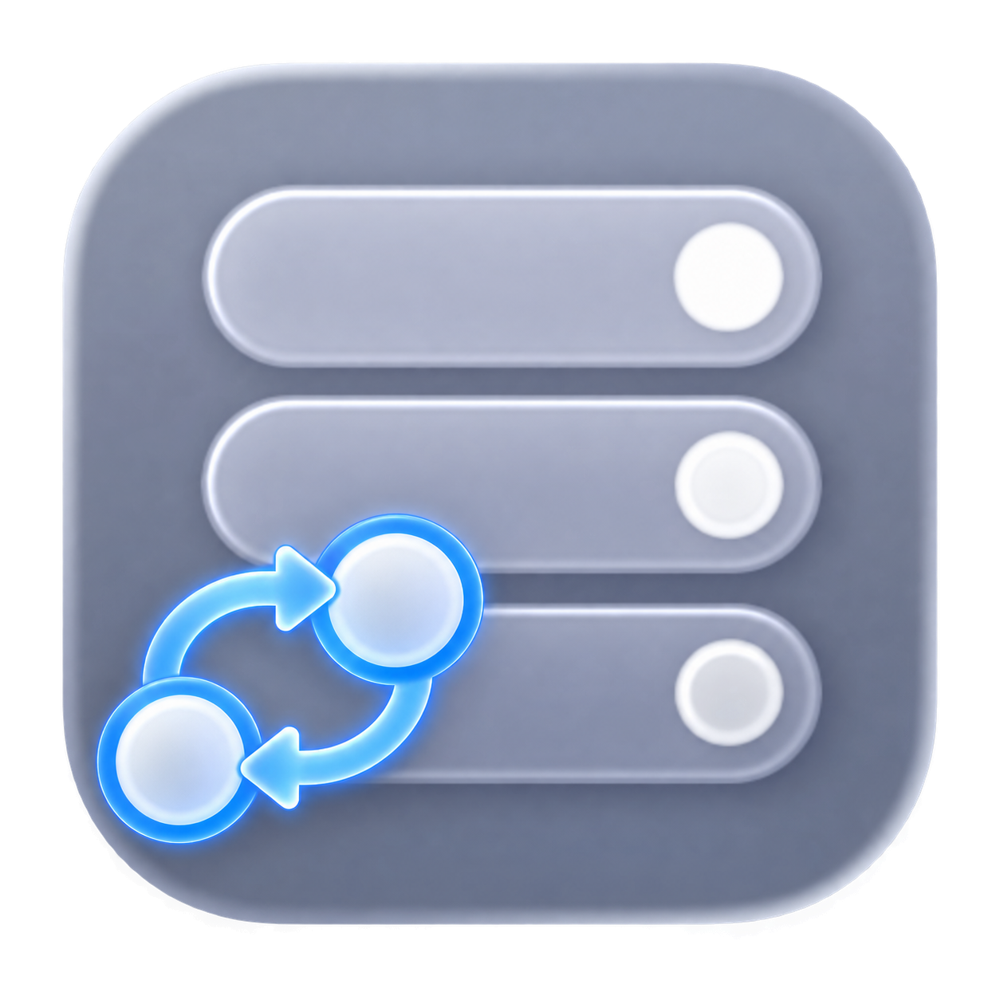

# gRPC Swift NIO Transport

<!-- markdownlint-disable MD013 MD033 -->

  
  
  
  
  
  
  
  
  
  
  
  
  

 
 
<!-- markdownlint-enable MD033 -->

This repository contains high-performance HTTP/2 client and server transport
implementations for [gRPC Swift][gh-grpc-swift-2] built on top of
[SwiftNIO][gh-swift-nio].

The `stephenlclarke` fork is maintained as a Container-family integration mirror for validating the transport used by [`container`](https://github.com/stephenlclarke/container), [`containerization`](https://github.com/stephenlclarke/containerization), and [`devcontainer`](https://github.com/stephenlclarke/devcontainer). The [`grpc/grpc-swift-nio-transport`](https://github.com/grpc/grpc-swift-nio-transport) repository remains the upstream source of truth, and the matched stack continues to consume upstream unless a reviewed fork-only correction is required.

`make coverage` runs the package tests with instrumentation and produces LCOV plus SonarQube generic coverage reports. `make sonar-scan` submits the reports with the exact checked-out commit as the project version; the hosted SonarQube workflow performs the same analysis for pull requests and `main`.

- 📚 **Documentation** is available on the [Swift Package Index][spi-grpc-swift-nio-transport].
- 🎓 **Tutorials** are available in the documentation for `grpc/grpc-swift-2` on
  the [Swift Package Index][spi-grpc-swift-2].
- 💻 **Examples** are available in the `Examples` directory of the
  [`grpc/grpc-swift-2`](https://github.com/grpc/grpc-swift-2) repository.
- 🚀 **Contributions** are welcome, please see [CONTRIBUTING.md](CONTRIBUTING.md).
- 🪪 **License** is Apache 2.0, repeated in [LICENSE](License).
- 🔒 **Security** issues should be reported via the process in [SECURITY.md](SECURITY.md).

[gh-swift-nio]: https://github.com/apple/swift-nio
[gh-grpc-swift-2]: https://github.com/grpc/grpc-swift-2
[spi-grpc-swift-nio-transport]: https://swiftpackageindex.com/grpc/grpc-swift-nio-transport/documentation
[spi-grpc-swift-2]: https://swiftpackageindex.com/grpc/grpc-swift-2/documentation
